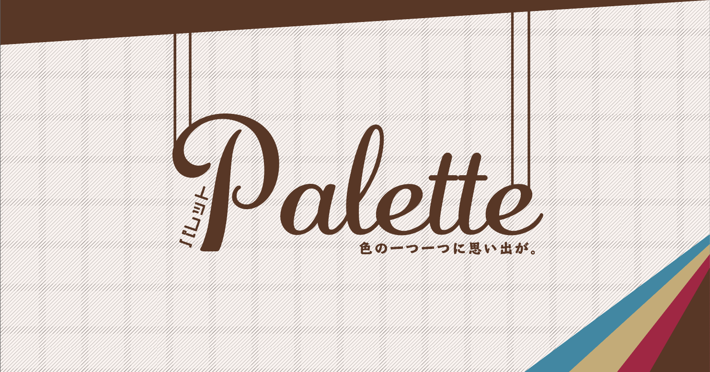
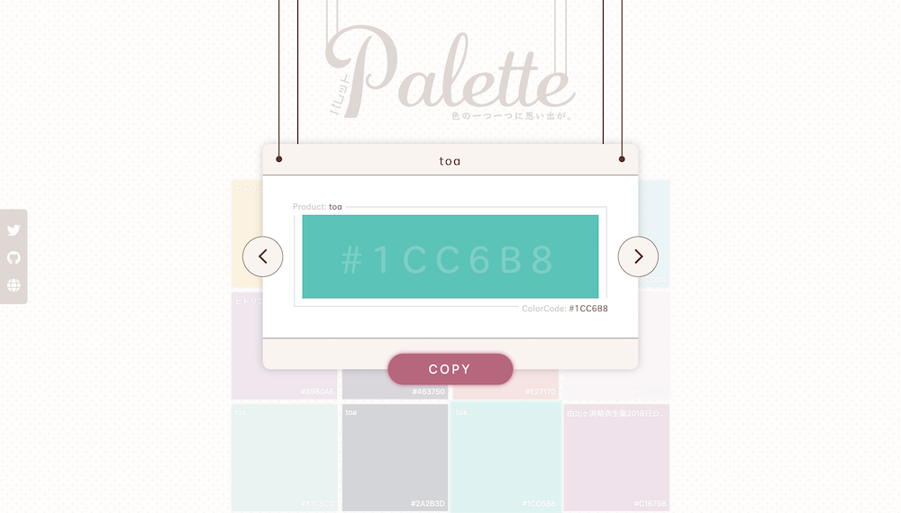

# palette - パレット

palette は、今まで作ってきた作品で使った色をまとめたサイトです。

『色の一つ一つに思い出が。』

- デザイン・モーション・コーディング
  - yui540
  - [https://twitter.com/yui540](Twitter - @yui540)

## 色一つ一つに思い出があります

僕が作品を作る上で、重要視するのは「色」です。

『色』を変えるだけで作品の印象は、大きく変わります。

なので、僕は過去に作ってきた作品でたくさんの色を使ってきました。

その色一つ一つに思い入れがあります。

palleteは、そんな思い入れのある色を使われた作品と共に紹介するサイトです。

